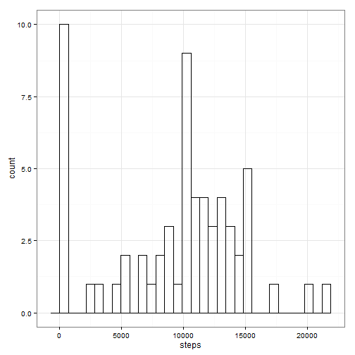
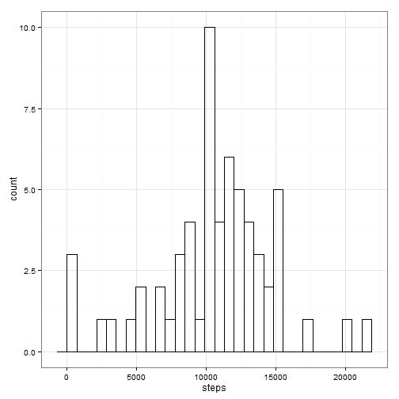
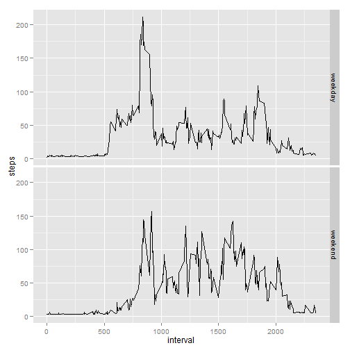

# Reproducible Research: Peer Assessment 1


## Loading and preprocessing the data
 

```r
# Load libraries for ploting and data manipulation
library(ggplot2)
library(dplyr)
```

```
## 
## Attaching package: 'dplyr'
## 
## The following objects are masked from 'package:stats':
## 
##     filter, lag
## 
## The following objects are masked from 'package:base':
## 
##     intersect, setdiff, setequal, union
```

```r
# Read file and check structure
#   1. Load the data
#   2. Process/fransform the data 

myData <- read.csv("activity.csv", colClasses = c("numeric", "character", "numeric"))
str(myData)
```

```
## 'data.frame':	17568 obs. of  3 variables:
##  $ steps   : num  NA NA NA NA NA NA NA NA NA NA ...
##  $ date    : chr  "2012-10-01" "2012-10-01" "2012-10-01" "2012-10-01" ...
##  $ interval: num  0 5 10 15 20 25 30 35 40 45 ...
```


## What is mean total number of steps taken per day?
*   Make a histogram of the total number of steps taken each day
*   Calculate and report the mean and median total number of steps taken per day


```r
# Build data frame of total, mean and median daily steps using dplyr package
daily <- group_by(select(myData,steps,date), date)
daily.steps <- summarise(daily, 
                         steps = sum(steps, na.rm = TRUE)
                         )

# Plot Histogram using ggplot2 package: Total Number of steps
ggplot(daily.steps, aes(x = steps)) + 
    geom_histogram(fill=NA, color="black") + 
    theme_bw()
```

```
## stat_bin: binwidth defaulted to range/30. Use 'binwidth = x' to adjust this.
```

 

```r
# Calculate daily mean and median steps
summarise(daily.steps,
          meanSteps = mean(steps, na.rm = TRUE),
          medianSteps = median(steps, na.rm = TRUE)
          )
```

```
## Source: local data frame [1 x 2]
## 
##   meanSteps medianSteps
## 1      9354       10395
```


## What is the average daily activity pattern?

*   Make a time series plot of the 5-minute interval (x-axis) and the average number of steps taken, averaged across all days (y-axis)
*   Which 5-minute interval, on average across all the days in the dataset, contains the maximum number of steps?


```r
# Build data frame of average steps across days by interval
intervals.data <- group_by(select(myData,steps, interval), interval)
interval.steps <- summarise(intervals.data, 
                         steps = mean(steps, na.rm = TRUE)
                         )

# Time Series Plot of Average Number of Steps by Interval (Using ggplot2 Package)

ggplot(interval.steps, aes(x = interval, y = steps)) + 
    geom_line()
```

 

```r
# Largest Intervals: Top 5 Largest Intervals
head(arrange(interval.steps, desc(steps)), n = 5)
```

```
## Source: local data frame [5 x 2]
## 
##   interval steps
## 1      835 206.2
## 2      840 195.9
## 3      850 183.4
## 4      845 179.6
## 5      830 177.3
```
Below we report interval by using embedded r code:

The interval with the largest number of average steps is 835

## Imputing missing values
*   Calculate and report the total number of missing values in the dataset (i.e. the total number of rows with NAs)
*   Devise a strategy for filling in all of the missing values in the dataset. The strategy does not need to be sophisticated. For example, you could use the mean/median for that day, or the mean for that 5-minute interval, etc.
*   Create a new dataset that is equal to the original dataset but with the missing data filled in.
*   Make a histogram of the total number of steps taken each day and Calculate and report the mean and median total number of steps taken per day. Do these values differ from the estimates from the first part of the assignment? What is the impact of imputing missing data on the estimates of the total daily number of steps?


```r
# Calculate the total number of missing values
sum(is.na(myData$steps))
```

```
## [1] 2304
```

```r
# Fill in missing values.  We develop a linear model based on interval and day of the week 

# First we create a new column. Day of Week
myData2 <- data.frame(myData, dayofweek = weekdays(as.Date(myData$date)), stringsAsFactors = FALSE)

# Fit a linear model based on interval and day of week and Impute where possible (Note: some interval are always NA)
fit <- lm(steps ~ interval + dayofweek, data = myData2)
use <- is.na(myData2$steps)
sum(use)
```

```
## [1] 2304
```

```r
myData2[use,1] <- predict(fit)[use]

# Impute all other with 0
use <- is.na(myData2$steps)
sum(use)
```

```
## [1] 288
```

```r
myData2[use,] <- 0

# Build data frame of total, mean and median daily steps using dplyr package
daily2 <- group_by(select(myData2,steps,date), date)
daily2.steps <- summarise(daily2, 
                         steps = sum(steps, na.rm = TRUE)
                         )

# Plot Histogram using ggplot2 package: Total Number of steps
ggplot(daily2.steps, aes(x = steps)) + 
    geom_histogram(fill=NA, color="black") + 
    theme_bw()
```

```
## stat_bin: binwidth defaulted to range/30. Use 'binwidth = x' to adjust this.
```

 

```r
# Calculate daily mean and median steps

# Original Data Set
summarise(daily.steps,
          meanSteps = mean(steps, na.rm = TRUE),
          medianSteps = median(steps, na.rm = TRUE)
          )
```

```
## Source: local data frame [1 x 2]
## 
##   meanSteps medianSteps
## 1      9354       10395
```

```r
# Imputed Data Set 
summarise(daily2.steps,
          meanSteps = mean(steps, na.rm = TRUE),
          medianSteps = median(steps, na.rm = TRUE)
          )
```

```
## Source: local data frame [1 x 2]
## 
##   meanSteps medianSteps
## 1     10594       10765
```

```r
# The imputed data set has higher mean and median values
```

## Are there differences in activity patterns between weekdays and weekends?
*   Create a new factor variable in the dataset with two levels – “weekday” and “weekend” indicating whether a given date is a weekday or weekend day.

*   Make a panel plot containing a time series plot (i.e. type = "l") of the 5-minute interval (x-axis) and the average number of steps taken, averaged across all weekday days or weekend days (y-axis).


```r
# Create new factor variable with two levels
myData2$weekpart <- "weekday"
myData2[myData2$dayofweek == "Saturday",5] <- "weekend"
myData2[myData2$dayofweek == "Sunday",5] <- "weekend"
myData2$weekpart <- as.factor(myData2$weekpart)
str(myData2)
```

```
## 'data.frame':	17568 obs. of  5 variables:
##  $ steps    : num  23.2 23.3 23.3 23.3 23.4 ...
##  $ date     : chr  "2012-10-01" "2012-10-01" "2012-10-01" "2012-10-01" ...
##  $ interval : num  0 5 10 15 20 25 30 35 40 45 ...
##  $ dayofweek: chr  "Monday" "Monday" "Monday" "Monday" ...
##  $ weekpart : Factor w/ 2 levels "weekday","weekend": 1 1 1 1 1 1 1 1 1 1 ...
```

```r
# Summarize by weekpart
intervals.data2 <- group_by(select(myData2,steps, weekpart, interval), weekpart, interval)
interval2.steps <- summarise(intervals.data2,
                         steps = mean(steps, na.rm = TRUE)
                         )

# Create Panel Plot (facets in ggplot2)

ggplot(interval2.steps, aes(x = interval, y = steps)) + 
    geom_line() +
    facet_grid(weekpart ~ .)
```

 

```r
# We observe differences in particular the higher values take place during the weekdays.
```
